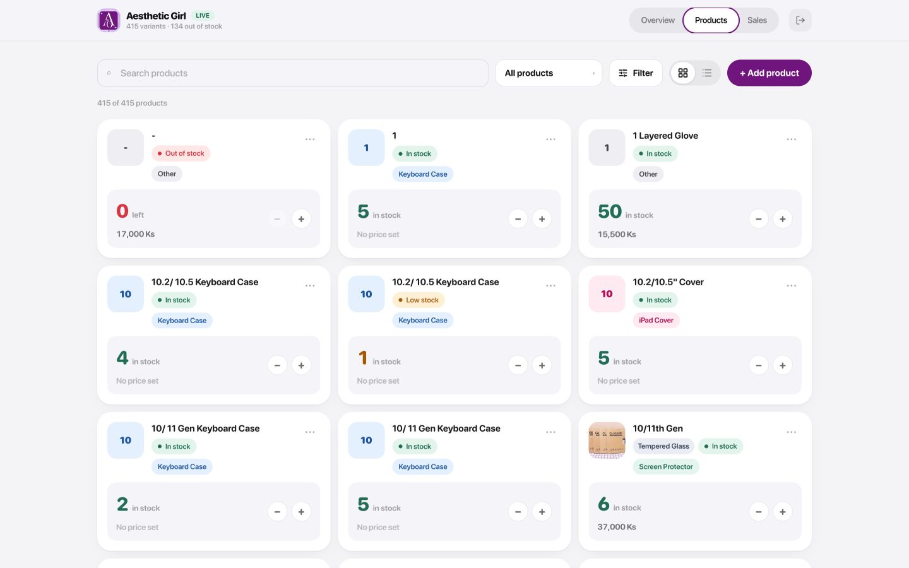
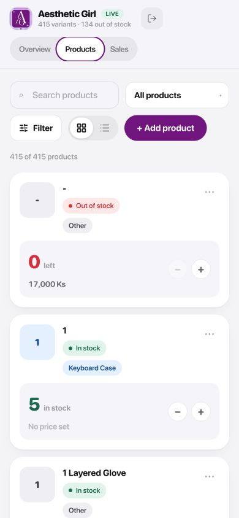

# Aesthetic Girl

<p align="center">
  
</p>

Inventory, sales, and expense management for Aesthetic Girl. The application is built with React and TypeScript, deployed on Vercel, and uses Supabase for authentication, shared shop data, and row-level access control.

**Live application:** [aesthetic-girl.vercel.app](https://aesthetic-girl.vercel.app/)

## Guest login

| Role | Email | Password | Access |
| --- | --- | --- | --- |
| Guest | `guest@email.com` | `P@ssw0rd!` | Can view every page, including expenses, but cannot edit |

> [!WARNING]
> Only the guest demo credential is documented. Privileged account credentials are intentionally omitted.

## Features

- Shared product inventory with stock status, search, category, colour, and iPad model filters
- Sales records and monthly revenue summaries
- Expense tracking and category breakdowns
- Responsive mobile and desktop layouts
- Supabase email/password authentication
- Database-enforced super admin, staff, and guest permissions
- Staff expense isolation and guest read-only access

## Product snapshots

### Desktop



### Mobile



## Technology

- React 19 and TypeScript
- Vite and Tailwind CSS
- Supabase Auth, Postgres, RPC functions, and Row Level Security
- Vercel hosting
- pnpm package management

## Local development

Requirements:

- Node.js 22.12 or newer
- pnpm

Install dependencies:

```bash
pnpm install
```

Create `.env.local` and add the public Supabase browser configuration:

```dotenv
VITE_SUPABASE_URL=https://YOUR_PROJECT_REF.supabase.co
VITE_SUPABASE_PUBLISHABLE_KEY=YOUR_PUBLISHABLE_KEY
```

Never place the Supabase secret key or service-role key in a `VITE_` environment variable. Vite exposes those variables to the browser.

Start the development server:

```bash
pnpm dev
```

## Supabase database

Database migrations are stored in [`supabase/migrations`](./supabase/migrations):

- `202607210001_aesthetic_girl.sql` creates the inventory, orders, sales, expenses, and supporting RPC functions.
- `202607210002_shared_shop_roles.sql` adds shared-shop memberships, role helpers, and role-based RLS policies.

To link and apply migrations to a Supabase project:

```bash
npx supabase link --project-ref YOUR_PROJECT_REF
npx supabase db push
```

The three authentication users must exist in Supabase Auth for their email addresses to be mapped into `public.shop_members`.

## Permission model

| Capability | Super admin | Staff | Guest |
| --- | :---: | :---: | :---: |
| View products and sales | Yes | Yes | Yes |
| Edit products and sales | Yes | Yes | No |
| View expenses | Yes | No | Yes |
| Edit expenses | Yes | No | No |

Permissions are applied in both the interface and Supabase Row Level Security. Hiding a control in the UI is not the only protection.

## Commands

```bash
pnpm dev      # Start the local Vite server
pnpm build    # Type-check and create a production build
pnpm lint     # Run Oxlint
pnpm preview  # Preview the production build locally
```

## Deployment

Add these environment variables to the Vercel project:

- `VITE_SUPABASE_URL`
- `VITE_SUPABASE_PUBLISHABLE_KEY`

Then deploy from the repository or with the Vercel CLI:

```bash
npx vercel --prod
```
